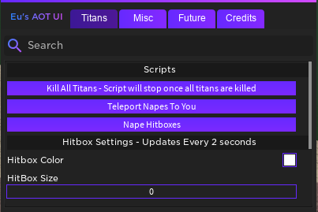

Eu's AOT Ui is built for the Attack On Titan:Downfall Series by Films. 

It will work on all three of the test builds (Regular Stress Test, Story Mode, Abnormal Only Mode). 

I hope to bring more features soon and continue my scripting career to become one of the best.

### Features

```markdown
- Lag Server
- Kill All Titans
- Teleport Napes To Char [BUGGY]
- Expand Nape Hitbox
- Built In Infinite Yield
- God Mode
- Heal Player
- Get Supplies
- Spam Eject Blades
- Auto-Rejoin / Kick
- More Coming Soon.
```
### UI Screenshot



### Download
```markdown
--If you cannot run loadstrings copy the link from within the loadstring then get the script from there.
loadstring(game:HttpGet(('https://raw.githubusercontent.com/EuHellscytheLua/AOTV0.01/master/EusAOTUi.lua')))()
```
### Support

For support join my discord server at - https://discord.gg/hX5ctkC

